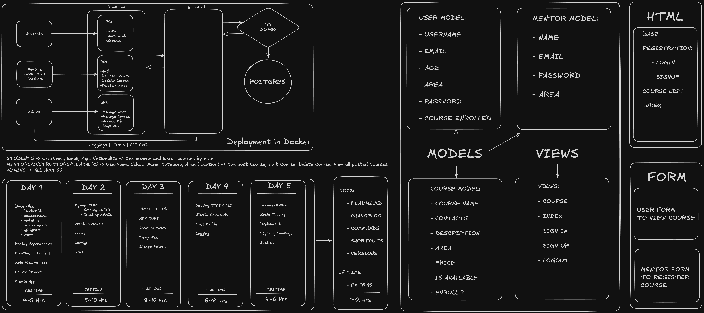

 # Project Hub - Course Management System


## Overview

Project Hub is a full-featured course management system built with Django, deployed on Kubernetes. It enables seamless interaction between Students and Mentors through an intuitive web interface with role-based access control, course enrollment, and administrative tools.

### Key Features

- **User Authentication** - Signup, login, and role-based access control
- **Course Management** - Create, manage, and enroll in courses
- **Student Dashboard** - View enrolled courses and track progress
- **Mentor Dashboard** - Manage created courses and students
- **RESTful API** - Built with Django REST Framework
- **Admin Interface** - Django admin for administrative tasks
- **HTTPS Support** - Self-signed certificates included

## Architecture

```
┌─────────────────────────────────────────────────────────────────┐
│                      User's Browser                              │
│                   (localhost:8443 HTTPS)                         │
└─────────────────────┬───────────────────────────────────────────┘
                      │
                      ▼
┌─────────────────────────────────────────────────────────────────┐
│                    NGINX Ingress                                 │
│              (TLS Termination, Routing)                          │
└─────────────────────┬───────────────────────────────────────────┘
                      │
          ┌───────────┴───────────┬───────────────┐
          ▼                       ▼               ▼
    ┌──────────────┐      ┌──────────────┐  ┌──────────────┐
    │   Frontend   │      │   Backend    │  │   Database   │
    │   (Nginx)    │      │   (Django)   │  │  (PostgreSQL)│
    │              │      │              │  │              │
    │ HTML/CSS/JS  │      │  REST API    │  │   Tables     │
    │ (Port 80)    │      │  (Port 8000) │  │  (Port 5432) │
    └──────────────┘      └──────────────┘  └──────────────┘
```

## Prerequisites

- Docker
- kubectl
- Minikube (for local development)
- OpenSSL (for TLS certificate generation)

## Installation & Setup

### Quick Start (One Command)

```bash
make setup
```

This runs: `install` → `deploy` → `test`

### Step-by-Step Setup

**Step 1: Install & Prepare**
```bash
make install
```
- Starts minikube
- Enables ingress addon
- Builds Docker images
- Creates TLS certificate

**Step 2: Deploy Application**
```bash
make deploy
```
- Applies all Kubernetes configs
- Deploys database, backend, frontend
- Sets up port forwarding
- Enables HTTPS access

**Step 3: Test**
```bash
make test
```
- Verifies all pods are running
- Tests HTTP endpoints
- Tests API connectivity

### Access the Application

After setup completes, access:

| Service | URL | Port |
|---------|-----|------|
| Frontend (HTTP) | http://localhost:8080 | 8080 |
| Backend API | http://localhost:8000/api | 8000 |
| Frontend (HTTPS) | https://localhost:8443 | 8443 |
| Admin Panel | http://localhost:8000/admin | 8000 |

**Note:** HTTPS uses self-signed certificate. Accept the browser warning on first access.

## Available Commands

```bash
make install    # Setup minikube and build images
make deploy     # Deploy to Kubernetes
make test       # Run tests
make cleanup    # Remove all resources
make setup      # Full setup (install + deploy + test)
make help       # Show all commands
```

Or use the interactive menu:
```bash
bash scripts/setup.sh
```

## Project Structure

```
├── backend/                 # Django REST API
│   ├── learning_hub/       # Django settings
│   ├── my_course/          # Course app
│   ├── cli/                # CLI tools
│   └── Dockerfile
│
├── frontend/               # Nginx + HTML/CSS/JS
│   ├── html/              # HTML pages
│   ├── css/               # Stylesheets
│   ├── js/                # JavaScript
│   ├── nginx.conf         # Nginx configuration
│   └── Dockerfile
│
├── database/              # PostgreSQL
│   ├── init.sql          # Initial schema
│   ├── Dockerfile
│   └── statefulset.yaml
│
├── ingress/              # Kubernetes ingress + TLS
│   ├── ingress.yaml
│   ├── tls.crt
│   └── tls.key
│
├── scripts/              # Automation scripts
│   ├── install.sh
│   ├── deploy.sh
│   ├── test.sh
│   ├── cleanup.sh
│   └── setup.sh
│
└── Makefile.local        # Make commands
```

## Cleanup

Remove all resources and reset:

```bash
make cleanup
```

## Troubleshooting

### Port Already in Use
```bash
pkill -f "kubectl port-forward"
```

### View Logs
```bash
bash scripts/setup.sh  # Select option 6
# Or directly:
kubectl logs -l app=frontend
kubectl logs -l app=backend
kubectl logs -l app=database
```

### Restart Services
```bash
kubectl rollout restart deployment/frontend
kubectl rollout restart deployment/backend
```

## Technologies Used

- **Frontend:** HTML5, CSS3, JavaScript, Nginx
- **Backend:** Django 5.1, Django REST Framework, Python 3.12
- **Database:** PostgreSQL 15
- **Infrastructure:** Kubernetes, Docker, Minikube
- **Security:** TLS/HTTPS, Self-signed certificates

## License

This project is licensed under the MIT License.
  This commands creates the .env file so you don't have to. Builds the container, migrates data, injects the data from .Json in the Postgres DB, opens the browser on the index of the app and finally re-opens logs.
  You can at anytime, log in or logout and create new user on the website. New comers always get Student role, to grants Mentor access you can proceed to Django Administration or using the CLI commands on the CLI section of this README.md.
  Following links have profiles already created so you can see how this SAaS works, from Student side to Mentor side.
  Following links available in case you need too and respective credentials:

  - http://localhost:8000/
  Access to following users:
    - User: Student
      - Password: useruser
      - Grants access to a Student user, with respective roles to see courses, enroll and check where you are enrolled.
    - User: Mentor
      - Password: useruser
      - Grants access to a Mentor user, with respectve roles to create, see own courses and who is enrolled to them. 

  - http://localhost:8000/admin
    - User: admin
      - Password: admin
      - Grants access to admininstration of Django.

  - http://localhost:8080/
  Access to Postgres:
    - System: PostgreSQL
    - Server: database
    - Username: postgres
    - Password: qwerty
    - Database: hub_db


### CLI Commands for Admin use Only
- `docker compose run --rm web poetry run python cli/cli.py super`
- `docker compose run --rm web poetry run python cli/cli.py create-user` 
- `docker compose run --rm web poetry run python cli/cli.py delete-user <username>`
- `docker compose run --rm web poetry run python cli/cli.py group-user <username> <groupname>`
- `docker compose run --rm web poetry run python cli/cli.py reset-group <username>`
- `docker compose run --rm web poetry run python cli/cli.py list-course`
- `docker compose run --rm web poetry run python cli/cli.py list-course --short`
- `docker compose run --rm web poetry run python cli/cli.py list-course --save`


### Requirements 
- Python 3.12.9+
- Docker 4.39.0 for Container compatilibty using Debian Docker in Docker.
- PostgreSQL
- Typer

### Dependencies
```toml
dependencies = [
    "django (>=5.1.7,<6.0.0)",
    "uvicorn (>=0.34.0,<0.35.0)",
    "psycopg2-binary (>=2.9.10,<3.0.0)",
    "typer (>=0.15.2,<0.16.0)",
    "whitenoise (>=6.9.0,<7.0.0)"
]
[tool.poetry.group.dev.dependencies]
pytest-django = "^4.10.0"
```

### How did I structured my project


### Project Structure
```projecthub/
├── .devcontainer/       
├── my_project/              
│   └── templates/          
├── my_course/       
│   ├── migrations/
│   ├── __init__.py
│   ├── admin.py
│   ├── apps.py
│   ├── forms.py
│   ├── models.py
│   ├── urls.py
│   └── views.py
├── static/   
├── projecthub/     
│   ├── settings.py
│   ├── urls.py
│   ├── asgi.py
│   └── wsgi.py
├── .env
├── compose.yaml
├── Dockerfile
├── manage.py
└── ...other root files ```


dev 1 nodes, staging 2 nodes, prod 3 nodes
terraform plan -var-file=spotify.tfvars -out spotify.plan
terraform workspace new spotify
cluster config (client, nodes, env, addons)

act as a DevOps in your answers:

Got it 👍
I’ll answer as a DevOps engineer from here on—practical, production-focused, and biased toward automation, reliability, security, and scalability.

Whenever you’re ready, tell me what you need help with, for example:

CI/CD pipelines (GitHub Actions, GitLab CI, Jenkins)

Cloud (AWS, GCP, Azure)

Containers & orchestration (Docker, Kubernetes, Helm)

IaC (Terraform, Pulumi, CloudFormation)

Monitoring & logging (Prometheus, Grafana, ELK, OpenTelemetry)

Linux, networking, security, or incident troubleshooting

What’s the task?

i was using k8s in my project. using minikube cache add i was using local custom images to use them in my deployments. I'm moving now to terraform and i wont be able to use any kubectl cmd. My teacher suggested to see how to build custom local docker images to have a look at null_resource or local_exec to help me. Can you give me a hand

Alright, DevOps hat on 🧢
You’re hitting a very common transition pain point when moving from “kubectl + minikube” to Terraform-managed workflows.

Let’s break this down cleanly and practically, then I’ll give you working patterns.

The core problem (what’s changing)
Before (imperative)
minikube cache add my-image:latest
kubectl apply -f deployment.yaml


You relied on:

Local Docker images

kubectl imperatively pushing them into Minikube’s Docker daemon

Now (declarative with Terraform)

Terraform cannot magically build Docker images

Terraform should not manage runtime cluster state directly

You still need a way to:

Build a local Docker image

Make it available to Minikube

Reference it in a Kubernetes Deployment

The right mental model (important)

Terraform:

✅ Good at orchestrating

❌ Not good at building artifacts

So the solution is:

Use Terraform to trigger Docker builds, not replace Docker.

This is exactly where null_resource + local-exec fits.

Option 1 (Recommended for Minikube): Build directly inside Minikube Docker

Minikube has its own Docker daemon.

If Terraform runs:

eval $(minikube docker-env)
docker build -t my-app:latest .


Then:

Image is immediately available

❌ No minikube cache add

❌ No registry needed

Terraform example (clean and minimal)
resource "null_resource" "build_image" {
  triggers = {
    dockerfile = filesha256("${path.module}/Dockerfile")
    src        = filesha256("${path.module}/app/main.py")
  }

  provisioner "local-exec" {
    command = <<EOT
      eval $(minikube docker-env)
      docker build -t my-app:latest .
    EOT
  }
}

Why this works well

triggers ensure rebuilds only when files change

Image lives inside Minikube

No registry complexity

Kubernetes deployment referencing the image
resource "kubernetes_deployment" "app" {
  metadata {
    name = "my-app"
  }

  spec {
    replicas = 1

    selector {
      match_labels = {
        app = "my-app"
      }
    }

    template {
      metadata {
        labels = {
          app = "my-app"
        }
      }

      spec {
        container {
          name  = "my-app"
          image = "my-app:latest"

          image_pull_policy = "IfNotPresent"
        }
      }
    }
  }

  depends_on = [null_resource.build_image]
}


🚨 Important

image_pull_policy = "IfNotPresent"


Otherwise Kubernetes will try to pull from Docker Hub.

Option 2: Using Docker provider (cleaner, but slightly heavier)

Terraform has a Docker provider.

Build image
provider "docker" {}

resource "docker_image" "app" {
  name = "my-app:latest"
  build {
    context = "${path.module}"
  }
}

BUT…

Docker provider builds on host Docker

Minikube won’t see it unless Docker is shared

So you’d still need:

eval $(minikube docker-env)


Which makes Option 1 simpler for learning.

Option 3 (More “real world”): Local registry (FYI)

In production-like setups:

Build image

Push to:

Local registry

Docker Hub

GHCR

Kubernetes pulls image

This is overkill for your course, but good to know.

What your teacher is guiding you toward

Your teacher mentioning:

null_resource

local_exec

Means:

“Use Terraform to orchestrate build steps, not replace kubectl”

This is exactly correct DevOps thinking.

Best practices (exam & real-world friendly)

✅ Keep builds outside Terraform when possible
✅ Use null_resource only for:

Local builds

Bootstrapping

Learning environments

❌ Don’t use Terraform as a CI tool in real prod
❌ Don’t rely on kubectl inside Terraform unless unavoidable

TL;DR (what you should implement)

Use Minikube Docker daemon

Build image via null_resource + local-exec

Set image_pull_policy = "IfNotPresent"

Add depends_on

If you want, I can:

Refactor this into a clean module

Show how to replace this later with CI/CD

Show how to do this without null_resource (advanced)

Just tell me 👌

explain me option 3

Alright, let’s go full DevOps-style explanation and demystify Option 3: Local registry.
This is closer to real-world workflows, even if it’s heavier than what your course strictly needs.

Option 3: Using a Local Docker Registry (DevOps-grade approach)
Why this exists (the “why” matters)

In real environments:

Kubernetes never uses local Docker images

Nodes pull images from a registry

CI builds → pushes image → cluster pulls

Minikube is special because it runs locally, but production clusters behave like this:

[ CI / Terraform trigger ]
        ↓
[ Docker build ]
        ↓
[ Docker Registry ]
        ↓
[ Kubernetes pulls image ]


So Option 3 emulates production even on your laptop.

What is a local registry?

A Docker registry running locally, usually:

localhost:5000

Or Minikube’s built-in registry addon

You:

Build image

Tag it for the registry

Push it

Kubernetes pulls it

Architecture (mental model)
+-------------------+
|   Terraform       |
|                   |
|  null_resource    |
|    local-exec     |
+---------+---------+
          |
          v
+-------------------+
| Docker build      |
| Docker push       |
+---------+---------+
          |
          v
+-------------------+
| Local Registry    |
| localhost:5000    |
+---------+---------+
          |
          v
+-------------------+
| Kubernetes Pod    |
| pulls image       |
+-------------------+

Two ways to do Option 3
3A️⃣ Minikube registry addon (BEST for Minikube)

Minikube can run a registry inside the cluster.

Enable it (one time)
minikube addons enable registry


Registry will be available at:

localhost:5000

Build & push image
docker build -t localhost:5000/my-app:latest .
docker push localhost:5000/my-app:latest


Kubernetes can now pull it.

Terraform automation (what you actually asked about)
resource "null_resource" "build_and_push" {
  triggers = {
    dockerfile = filesha256("${path.module}/Dockerfile")
    src        = filesha256("${path.module}/app/main.py")
  }

  provisioner "local-exec" {
    command = <<EOT
      docker build -t localhost:5000/my-app:latest .
      docker push localhost:5000/my-app:latest
    EOT
  }
}

Kubernetes deployment
resource "kubernetes_deployment" "app" {
  metadata {
    name = "my-app"
  }

  spec {
    replicas = 1

    selector {
      match_labels = {
        app = "my-app"
      }
    }

    template {
      metadata {
        labels = {
          app = "my-app"
        }
      }

      spec {
        container {
          name  = "my-app"
          image = "localhost:5000/my-app:latest"
        }
      }
    }
  }

  depends_on = [null_resource.build_and_push]
}


✅ No imagePullPolicy hacks needed
✅ Very close to production behavior

3B️⃣ External local registry container (generic Docker way)

Run a registry yourself:

docker run -d -p 5000:5000 --name registry registry:2


Same build/push logic:

docker build -t localhost:5000/my-app:latest .
docker push localhost:5000/my-app:latest


⚠️ For Minikube you’ll need to:

Expose registry to the cluster

Configure insecure registry

This is why 3A is preferred.

Why Option 3 is “more DevOps correct”
Aspect	Option 1	Option 3
Local-only	✅	❌
Prod-like	❌	✅
Registry flow	❌	✅
CI/CD ready	❌	✅
Complexity	Low	Medium
When should YOU use Option 3?

Use Option 3 if:

Your teacher wants production-like workflows

You want to understand real CI/CD pipelines

You want to avoid Minikube-specific hacks

Avoid it if:

You’re just learning Terraform basics

You want the fastest iteration

Real-world note (important)

In real companies:

Terraform does NOT build images

CI (GitHub Actions / GitLab CI) does:

docker build

docker push

Terraform only references image tags

What you’re doing here is acceptable for learning only.

TL;DR

Option 3 = Build → Push → Pull

Uses a local registry (localhost:5000)

Most realistic Kubernetes workflow

Slightly more setup, much better mental model

If you want, next I can:

Show how to convert this into a CI pipeline

Compare this with Helm

Explain why Terraform + Kubernetes provider has limits

Just tell me 👌

remember i'm using terraform ok, not k8s

👍 Got it — Terraform-first mindset, no Kubernetes CLI usage, and I’ll stay strict about that.

Let me re-explain Option 3 (local registry) purely from a Terraform/DevOps perspective, without slipping into “Kubernetes user” language.

Option 3 — Local Registry, but Terraform is the orchestrator

You are not “using Kubernetes” manually.
You are:

Using Terraform to:

Build a Docker image

Push it to a registry

Declare infrastructure/state that consumes that image

Terraform is coordinating tools, not replacing them.

Why this option exists (Terraform reality check)

Terraform:

❌ Cannot build container images natively

❌ Cannot cache images like minikube cache add

✅ Can orchestrate external steps

A registry becomes the contract between:

Image build step

Runtime platform (Kubernetes provider, Nomad, etc.)

This is exactly how Terraform is used in real DevOps stacks.

Terraform-only flow (no kubectl, no minikube cache)
Terraform apply
│
├── null_resource (local-exec)
│     ├── docker build
│     └── docker push
│
└── kubernetes_* resources
      └── reference image from registry


Terraform controls order and dependencies.

Step 1 — Registry (assumed, not managed by Terraform)

For learning:

Registry exists at localhost:5000

It could be:

Minikube addon

Docker registry container

Remote registry (GHCR, Docker Hub)

Terraform does not care — it just pushes to it.

Step 2 — Build & push via Terraform (key part)

This is the Terraform-native way to do it.

resource "null_resource" "image" {
  triggers = {
    dockerfile = filesha256("${path.module}/Dockerfile")
    source     = filesha256("${path.module}/src/main.go")
  }

  provisioner "local-exec" {
    command = <<EOT
      docker build -t localhost:5000/my-app:latest .
      docker push localhost:5000/my-app:latest
    EOT
  }
}

Why this is Terraform-correct

null_resource = procedural step

triggers = idempotency

Terraform state tracks when rebuilds happen

No imperative CLI tools like kubectl

Step 3 — Terraform resource consumes the image

Whether it’s:

kubernetes_deployment

helm_release

nomad_job

Terraform only references the image by name.

resource "kubernetes_deployment" "app" {
  metadata {
    name = "my-app"
  }

  spec {
    template {
      spec {
        container {
          name  = "app"
          image = "localhost:5000/my-app:latest"
        }
      }
    }
  }

  depends_on = [null_resource.image]
}


This is declarative infrastructure, not cluster manipulation.

Why this satisfies your teacher’s constraint

Your teacher said:

“Look at null_resource or local_exec”

This pattern:

✔ No kubectl

✔ No minikube cache

✔ Fully Terraform-driven

✔ Reproducible

✔ Matches real CI/CD logic

You’re doing exactly what they expect.

What this teaches you (important for exams/interviews)

Terraform is not a build tool

Artifacts live outside Terraform

Registries decouple build from deploy

Declarative infra + procedural glue is normal

This is senior DevOps thinking, not beginner stuff.

Common mistakes (avoid these)

❌ Running kubectl inside local-exec
❌ Letting Terraform rebuild images every apply
❌ Using latest without understanding cache
❌ Treating Terraform as CI

When this pattern disappears (real world)

Later, you’ll move to:

CI:
  docker build
  docker push

Terraform:
  reference image:tag


Terraform will stop building images entirely.

TL;DR

You are using Terraform, not Kubernetes

Registry is the contract

null_resource + local-exec is the glue

This is the correct DevOps pattern

If you want next, I can:

Rewrite this using Docker provider

Show how to avoid null_resource entirely

Explain how examiners expect you to justify this design

Just say the word 👌

in option 1, explain me the triggers how they work, what should they contain

Perfect question. This is exactly where most people misuse null_resource.

I’ll explain this as a DevOps + Terraform practitioner, very concretely and focused on Option 1.

triggers in null_resource — what they REALLY do
The short version

triggers tell Terraform when a null_resource must be recreated.

Since provisioners only run:

on create

on destroy

triggers are the only mechanism to re-run your local-exec logic.

Why triggers are mandatory in Option 1

Option 1:

docker build -t my-app:latest .


Without triggers:

Terraform runs it once

Code changes ❌ do not rebuild image

Dockerfile changes ❌ do not rebuild image

That’s unacceptable even for learning.

How Terraform sees a null_resource

Terraform does not understand:

Docker

Images

Source code

It only understands inputs → state → diffs.

So you must give it inputs that change when your image should change.

That’s what triggers are.

How triggers work internally

Example:

resource "null_resource" "build_image" {
  triggers = {
    dockerfile = filesha256("${path.module}/Dockerfile")
  }

  provisioner "local-exec" {
    command = "docker build -t my-app:latest ."
  }
}


Terraform behavior:

Computes SHA256 of Dockerfile

Stores it in state

Next terraform apply:

If hash is the same → do nothing

If hash changed → destroy & recreate resource

Recreate = rerun local-exec

This is the entire mechanism.

What triggers should contain (Option 1)
Rule of thumb (important)

Include everything that affects the Docker image output

✅ Common trigger inputs
1. Dockerfile (mandatory)
dockerfile = filesha256("${path.module}/Dockerfile")

2. Application source files
app = filesha256("${path.module}/app/main.py")


Or if multiple files:

app = filesha256(join("", fileset("${path.module}/app", "**")))


(We’ll refine this in a second.)

3. Build args (if used)
build_args = var.build_env

Handling multiple source files (important detail)

Terraform cannot hash directories directly.

❌ Wrong
filesha256("${path.module}/app")

✅ Correct pattern
locals {
  app_files = fileset("${path.module}/app", "**")
  app_hash  = sha256(
    join("", [
      for f in local.app_files :
      filesha256("${path.module}/app/${f}")
    ])
  )
}

resource "null_resource" "build_image" {
  triggers = {
    dockerfile = filesha256("${path.module}/Dockerfile")
    app        = local.app_hash
  }

  provisioner "local-exec" {
    command = "docker build -t my-app:latest ."
  }
}


This ensures:

Any file change

Any file add/remove
Triggers rebuild.

What triggers should NOT contain

❌ Random values
❌ Timestamps
❌ uuid()
❌ Anything that changes on every apply

Example of what NOT to do:

triggers = {
  always = timestamp()
}


This causes:

Rebuild on every terraform apply

Breaks idempotency

Terraform anti-pattern

Why triggers force recreate (not update)

null_resource has:

No real lifecycle

No “update” phase

So Terraform does:

destroy → create


That’s fine because:

Image build is stateless

No real resource is destroyed

How this ties into Option 1 (Minikube Docker daemon)

Your full Option 1 logic:

resource "null_resource" "build_image" {
  triggers = {
    dockerfile = filesha256("${path.module}/Dockerfile")
    app        = local.app_hash
  }

  provisioner "local-exec" {
    command = <<EOT
      eval $(minikube docker-env)
      docker build -t my-app:latest .
    EOT
  }
}


Terraform guarantees:

Image is rebuilt only when needed

Deployment depends on image existence

Exam / teacher-level explanation (memorize this)

triggers are used to convert external state (files, source code, configs) into Terraform-trackable inputs so that null_resource provisioners can be re-executed deterministically.

That sentence alone will score points.

TL;DR

null_resource runs provisioners only on create/destroy

triggers control when recreation happens

Hash everything that affects the image

Never use random or time-based triggers

This is how Terraform stays declarative

If you want next, I can:

Show a minimal trigger set vs production-grade

Explain why null_resource is considered “last resort”

Compare this with Docker provider triggers

Just say 👌

so what null_resource do, what trigger do, what local exec do

Perfect — this is the foundational Terraform question, and once you get this, everything else clicks.

I’ll explain it cleanly, in DevOps terms, no Kubernetes noise.

1️⃣ What null_resource does
Definition (Terraform-level)

null_resource is a Terraform resource with no real infrastructure.

It exists only to:

Participate in Terraform’s dependency graph

Have lifecycle

Run provisioners

Think of it as a placeholder node in Terraform’s execution plan.

Why it exists

Terraform normally manages:

Servers

Networks

Clusters

Load balancers

But sometimes you need to:

Run a script

Build an artifact

Bootstrap something external

null_resource gives Terraform something to attach behavior to.

Mental model
Terraform graph:
  resource A
      ↓
  null_resource (does something procedural)
      ↓
  resource B


No infra is created — only side effects happen.

Key properties

No provider interaction

No physical resource

Only meaningful because:

It has state

It can be depended on

2️⃣ What triggers do
Definition

triggers are a set of values Terraform tracks in state.

If any value changes, Terraform:

Destroys the null_resource

Recreates it

That recreation is what causes provisioners to rerun.

Why triggers exist

Provisioners:

Run once on create

Do not rerun automatically

triggers convert external changes (files, configs, vars) into something Terraform understands.

Example
triggers = {
  dockerfile = filesha256("Dockerfile")
}


Terraform logic:

Store hash in state

Next apply:

Same hash → no change

Different hash → recreate resource

Important DevOps insight

Terraform does not watch files.
You explicitly tell it what matters.

What triggers should represent

“Anything that should cause this action to re-run”

For Docker builds:

Dockerfile

Source code

Build arguments

Version tags

3️⃣ What local-exec does
Definition

local-exec is a provisioner that runs a command on the machine executing Terraform.

Not on:

Kubernetes

Cloud VM

Cluster node

On your local system or CI runner.

What it’s used for

docker build

docker push

curl

bash scripts

Bootstrapping external tools

Example
provisioner "local-exec" {
  command = "docker build -t my-app ."
}


Terraform behavior:

Runs this only when the resource is created

Not on every apply

Key limitation (very important)

No rollback

No output tracking

No idempotency guarantees

Terraform assumes:

“If the command exits 0, it worked.”

How they work together (the full picture)
resource "null_resource" "build_image" {
  triggers = {
    dockerfile = filesha256("Dockerfile")
    app        = local.app_hash
  }

  provisioner "local-exec" {
    command = "docker build -t my-app ."
  }
}

Step-by-step execution

Terraform evaluates triggers

Sees change → marks resource for recreation

Destroy old null_resource

Create new null_resource

local-exec runs

State updated with new trigger values

One-sentence summary (exam gold)

null_resource: a Terraform lifecycle wrapper for non-infrastructure actions

triggers: change detectors that control when those actions re-run

local-exec: the mechanism that performs the action locally

DevOps best-practice warning (important)

null_resource + local-exec is:

✅ OK for learning

✅ OK for bootstrapping

❌ Bad for long-term production builds

In real systems:

CI builds images

Terraform only references outputs

TL;DR
Component	Purpose
null_resource	Lifecycle & dependency node
triggers	Decide when to rerun
local-exec	Execute local command

If you want next, I can:

Show a diagram with lifecycle

Explain why HashiCorp discourages provisioners

Rewrite this using pure Terraform providers

Just say 👌
